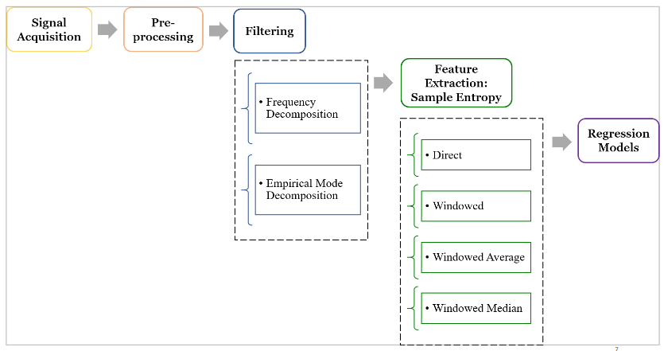
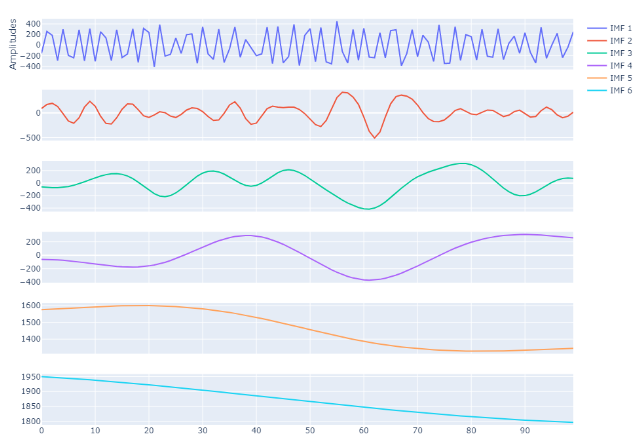
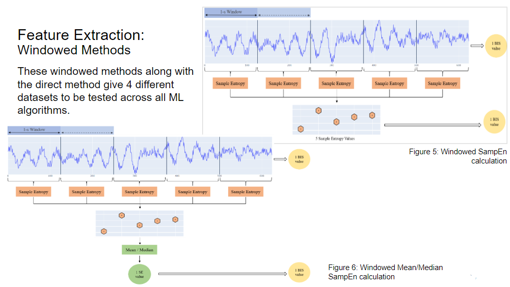
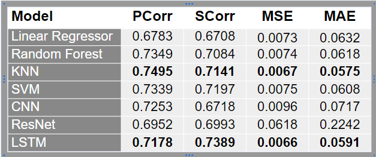

# Depth_of_Anesthesia

The goal of this project is to develop an EEG-based index for evaluating Depth of Anesthesia (DoA) for patients receiving general anesthesia. 

- General anesthesia (GA) is a temporary drug-induced unconsciousness state, which is reversible under human manipulation. If given at the wrong dosage, GA can cause postoperative side effects including delirium and cognitive dysfunction.
- The Bi-spectral Index (BIS) quantifies changes in the electrophysiologic state of the brain during anesthesia.
- The BIS may not correctly reflect patients’ status when NMDA-dependent anesthetic agents such as ketamine and nitrous oxide are used. Thus an alternative metric is required that can compete with the gold-standard

# Methodology pipeline

# Empirical Mode Decoposition
- Empirical Mode Decomposition (EMD) is a method to break down a signal into a finite number of components. 
- EMD algorithm uses statistical means to reduce the signal into several simple oscillatory functions called Intrinsic Mode Functions (IMFs). 
- These functions are combined to reconstruct the original signal. 
- The IMFs are extracted and subtracted from the original signal to get a residual signal. 
- This “sifting process” occurs recursively to generate many IMFs until the stopping criteria is achieved.

# Feature Extraction
## Sample Entropy:

- Entropy measures the randomness or irregularity of the signals. 
- Increase in depth of anesthesia is shown to correspond with decreased randomness, with the EEG signals displaying more consistency, implying more stability and predictability of the system.
- Non-linear entropies and complexity features have received attention as they provide a better representation of the patient’s level of consciousness.

# Windowing
To obtain multiple values of sample entropy, that are averaged or used as is and compared against BIS values.

# ML models used:

- Linear Regression
- K-nearest neighbours
- Random Forest
- Support Vector Machine

- Convolutional Networks (CNN)
- Residual Networks (ResNet)
- Long-Short Term Memory Networks (LSTMs)

# Results

